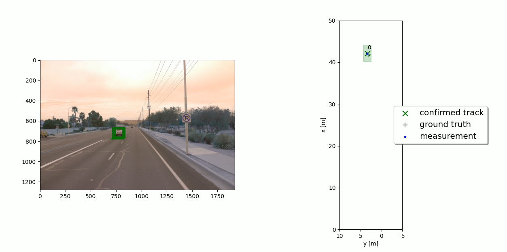
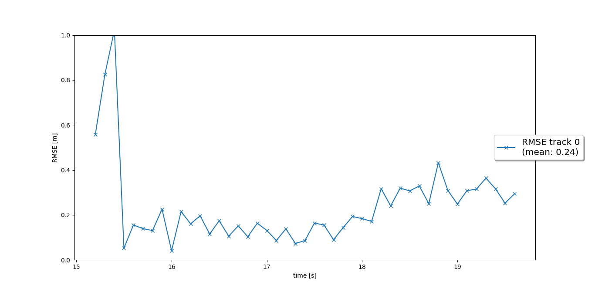
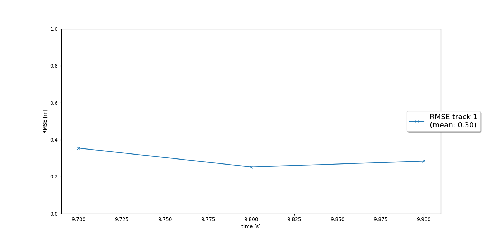
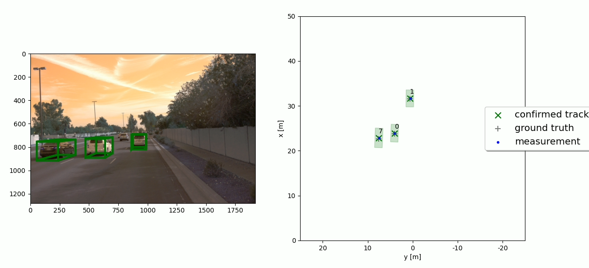
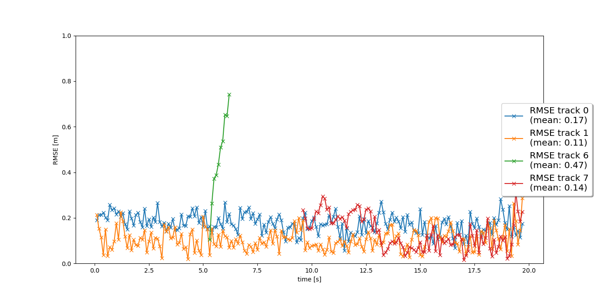

# Sensor Fusion and Object Detection

## Installation Instructions

Download or clone this github repository with the starter code: https://github.com/udacity/nd013-c2-fusion-starter . You need to maintain the project file structure according to it.

Follow all the installation instructions in the github repository: https://github.com/udacity/nd013-c2-fusion-starter#installation-instructions-for-running-locally

You also need to install Python 3.7 and all the requirements in the file requirements.txt by typing this command in the terminal: pip3 install -r requirements.txt.

This project consists of four main steps:

  Step 1: Implementing an Extended Kalman Filter.
  Step 2: Implementing track management including track state and track score, track initialization and deletion.
  Step 3: Implementing single nearest neighbour data association and gating.
  Step 4: Applying sensor fusion by implementing the nonlinear camera measurement model and a sensor visibility check.
By completing all the steps of the project, we will have implemented our own sensor fusion system that is able to track vehicles over time with real-world camera and lidar measurements.

## 1. Write a short recap of the four tracking steps and what you implemented there (filter, track management, association, camera fusion). Which results did you achieve? 

  ## Step 1: Extended Kalman Filter

  •	I have implemented the predict() function for Extended Kalman Filter (EKF) along with the F() and Q() functions to calculate the system matrix for constant velocity process model in 3D and the corresponding process noise covariance depending on the current timestep dt. At the end of the prediction step, save the resulting x and P by calling the functions set_x() and set_P().
  •	Implementing the update() function as well as the gamma() and S() functions for residual and residual covariance to get the measurement function evaluated at the current state, h(x), and the Jacobian H.
  •	Using numpy.matrix() for all matrices as learned in the exercises.

  ## Output: 

  

    
     
    <em>Single target tracking</em>
  

  
  
  

    
     
    <em>RMSE value</em>
  

  Here, the RMSE value for this step is 0.24 which checks our project requirement (RMSE<=0.35).

  ## Step 2: Track Management

  •	Replacing the fixed track initialization values by initialization of track.x and track.P based on the input meas. Also, Initialize the track state with 'initialized', where window is the window size parameter, as learned in the track management lesson.
  •	Implementing the manage_tracks() function by decreasing the track score and deleting tracks if the score is too low or P is too big.
  •	Implementing the handle_updated_track() function by increasing the track score and setting the track to ‘tentative’ or ‘confirmed’. 

  ## Output: 

  

    
     
    <em>RMSE value</em>
  

  

  ## Step 3: Data Association

  •	Replacing association_matrix with the actual association matrix based on Mahalanobis distances for all tracks in the input track_list and all measurements in the input meas_list along with the MHD()function to implement the Mahalanobis distance between a track and a measurement. I have also used the gating_ok() function to check if a measurement lies inside a track’s gate. 
  •	Updating the list of unassigned measurements unassigned_meas and unassigned tracks unassigned_tracks.
  •	Finding the minimum entry in association_matrix, delete corresponding row and column from the matrix.

  ## Output: 

  

    
     
    <em>Tracking result</em>
  

   

  ## Step 4: Camera Sensor Fusion

  •	Implementing the function in_fov() that checks if the input state vector x of an object can be seen by this sensor.
  •	Implementing the function get_hx() with the nonlinear camera measurement function h by transforming position estimate from vehicle to camera coordinates.
  •	Removing the restriction to lidar in the function generate_measurement() in order to include camera as well.
  •	Initializing camera measurement objects including z, R, and the sensor object sensor.
  Here, our RMSE plot showed four confirmed tracks. There were no ghost tracks or track loss. Two of the tracks (track 0 and track 1) are tracked from beginning to end of the sequence (0s - 200s) without track loss. The mean RMSE for these two tracks is below 0.25. Therefore, it follows the project rubrics. 
  A video of “my_tracking_results.avi” for the tracking of vehicles can be found inside the project folder to visualize how the overall program is working.

  ## Output: 

  

    
     
    <em>RMSE value</em>
  

  
## Tracking Movie

The tracking movie is saved under the directory /result/movies. A sample of the generated movie is included in the directory /video.

    

## 1.1	Which part of the project was most difficult for you to complete, and why?  

Overall, the project was well structured. All the contents of this program provided enough basic to complete this sensor fusion and object detection project. But it was a bit difficult for me to grasp the overall structure of the project. By going through the course contents and the project instructions helped me get through it.

Also, I had trouble working this project on Spyder IDE. No matter how much I tried, my program couldn’t locate the dataset which eventually failed to execute the loop_over_dataset.py file. But after switching to Visual Studio Code, everything went well.

There were some other issues with getting the correct RMSE value, deleting old tracks, implementing the camera measurement model. In addition, if one part of the project is programmed in a wrong way, the whole thing is affected by it. But by revisiting the course contents, I got the perfect outcome. 

## 2. Do you see any benefits in camera-lidar fusion compared to lidar-only tracking? 

Theoretically, camera has more resolution and frames per second than LIDAR which is why camera is better at object detections. On the other hand, LIDAR does not offer that colour based information in object detection. But the advantage LIDAR has is that it can provide comparatively precise spatial coordinate for target orientation identification.

In addition, Camera systems can provide us information such as traffic and speed signs by measuring colour and light intensity. LIDAR can operate perfectly in darkness or during rain with the help of its active sensor while cameras are less accurate at dark environment. 

Moreover, Camera measurements are ambiguous in the lines of ray tracing. Throughout these lines, any depth is valid and ambiguous. This ambiguity is resolved by using lidar measurements which have accurate depth information. 

All in all, each system has advantage on specific use cases. Camera-LIDAR fusion will increase the accuracy of the tracking system by having wider range of vision which will help detect objects more precisely.

## 3. Which challenges will a sensor fusion system face in real-life scenarios? 

Our sensor fusion system can face many real-life problems. 

•	Our system was developed using precomputed detection where theses videos were recorded during daylight. So, in real life scenario, when our system faces dark condition, it may not perform well considering camera measurements are less accurate at night time.
•	Another challenge would be expecting precise result from measurement noise configuration. Instead of setting a fixed noise variance, ideal scenario would be each measurement should have its own variance.
•	In real world scenario, we need multiple tracks and measures to have accurate association. But the challenging part is to set a proper gating threshold for all scenario.
Another common challenge is extrinsic parameters calibration. Proper configuration for camera and LIDAR extrinsic parameter is quite important for such projects. Since we are using publicly available dataset, our project does tackle this issue by having known parameters. 

## 4. Can you think of ways to improve your tracking results in the future? 

We can improve our tracking result by implementing the following suggestions:

1.	By fine-tuning our parameterization and trying to achieve as low RMSE value as possible.
2.	Implementing a more advanced data association such as, Global Nearest Neighbour (GNN) or Joint Probabilistic Data Association (JPDA). 
3.	Adapting the Kalman filter to also estimate the object's width, length, and height, instead of simply using the unfiltered lidar detections as we did in our system.
4.	Using a non-linear motion model such as, a bicycle model, which is more appropriate for vehicle movement than our linear motion model.

Here is the GitHub repository of my solution: https://github.com/tralpha/Sensor-Fusion-and-Object-Detection 
